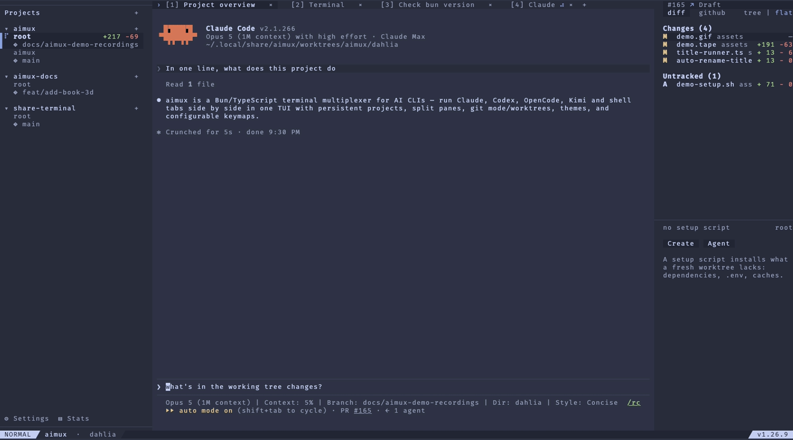

# aimux

A terminal multiplexer for AI CLIs. Manage multiple AI assistant sessions (Claude, Codex, OpenCode) side by side in a single terminal with tabbed navigation, split panes, persistent sessions, and fully configurable keybindings.




## Features

- **Multi-tab sessions** — Run Claude, Codex, and OpenCode in parallel with instant tab switching
- **Session bar** — Numbered session chips at the top (or bottom) of the screen. Click to switch, drag to reorder, busy spinner for non-focused sessions with live PTY output. Toggle with `<leader>b`; jump with `<leader>1..9`. Position persists via `aimux.config.ts` or `aimux.json`.
- **Split panes** — Split vertically (`|`) or horizontally (`-`) to view multiple assistants at once
- **Draggable separators** — Resize split panes by dragging with the mouse
- **Click-to-focus** — Click any pane or sidebar tab to focus it instantly
- **Full terminal emulation** — Powered by xterm.js with mouse tracking, alternate buffer, and scrollback
- **Configurable nvim-style keymaps** — Define keybinds in a typed `aimux.config.ts` with leader keys, multi-key sequences, and a prefix-trie resolver
- **Text selection** — Double-click for a word, triple-click for a line, drag for a region. Selections copy to system clipboard automatically
- **Project-scoped sessions** — Associate a git repository with each session; all tabs spawn in that directory
- **Directory picker** — Fuzzy-search git repos and worktrees from `$HOME` using `fzf`
- **Session persistence** — Workspace state (tabs, titles, layout) saved and restored on restart
- **Git status panel** — Branch + diff summary in the sidebar
- **Seamless daemon updates** — A restartable IPC daemon now reconnects to a long-lived terminal manager, so updates and IPC changes do not kill live tabs
- **Snippets** — Save and reuse prompt snippets across sessions
- **Theme picker** — Switch between 11 built-in themes on the fly
- **Pending-chord indicator** — Bottom-right overlay shows mid-sequence key state (like nvim's `which-key`)
- **Built-in help** — Press `?` to see all keybindings

### Session Management


### Multi-Tab Workflow


### Themes


### Split Panes


## Install

```bash
bun install -g @brimveyn/aimux
```

Requires [Bun](https://bun.sh).

## Usage

```bash
aimux                  # start the TUI
aimux version          # print version
aimux doctor           # check setup
aimux update           # self-update
aimux restart-daemon   # restart IPC daemon only
```

`aimux update` and `aimux restart-daemon` restart only the IPC daemon. Live PTYs and headless terminal state stay in the long-lived terminal-manager process, so active tabs can be reattached instead of being restarted.

## Configuration

aimux reads `~/.config/aimux/<profile>/aimux.config.ts` at startup. The default installed profile is `default`, while the repository dev scripts use `dev`. Set up the default profile with:

```bash
mkdir -p ~/.config/aimux/default && cd ~/.config/aimux/default
bun init -y
bun add -d @brimveyn/aimux-config
```

Then create `~/.config/aimux/default/aimux.config.ts`:

```ts
import { defineConfig, actions, themes } from '@brimveyn/aimux-config'

export default defineConfig({
  theme: themes.extend('tokyo-night', { accent: '#ff9e64' }),

  keymaps: (k) =>
    k
      .leader('<Space>')
      .timeout(300)
      .mode('navigation', (m) =>
        m
          .map('j', actions.nextTab)
          .map('k', actions.prevTab)
          .map('<leader>g', actions.sessionPicker)
          .group('<leader>t', 'tabs', (g) =>
            g.map('n', actions.newTab).map('r', actions.renameTab).map('x', actions.closeTab)
          )
      )
      .mode('terminal-input', (m) =>
        m.map('<leader>|', actions.splitVertical).map('<leader>-', actions.splitHorizontal)
      ),
})
```

User bindings override defaults. Use `.unmap(keys)` to remove a default. See [`@brimveyn/aimux-config`](packages/aimux-config/README.md) for the full builder API.

### Key notation

| Notation       | Meaning                    |
| -------------- | -------------------------- |
| `j`            | Bare character             |
| `J`            | Shift+J (uppercase letter) |
| `<C-n>`        | Ctrl+N                     |
| `<M-x>`        | Meta/Alt+X                 |
| `<CR>` `<Esc>` | Return / Escape            |
| `<leader>`     | Configured leader chord    |
| `dd`           | Multi-key sequence         |
| `<leader>tn`   | Leader, then t, then n     |

## Default Keymaps

Press `?` in navigation mode for the full, live keybinding list (reflects your config).

### Navigation Mode

| Key                   | Action               |
| --------------------- | -------------------- |
| `j` / `k`             | Next / previous tab  |
| `Shift+J` / `Shift+K` | Reorder tabs         |
| `i`                   | Enter terminal input |
| `r`                   | Rename active tab    |
| `dd`                  | Close active tab     |
| `Ctrl+N`              | New tab              |
| `Ctrl+R`              | Restart tab          |
| `Ctrl+G`              | Session picker       |
| `Ctrl+B`              | Toggle sidebar       |
| `Ctrl+H` / `Ctrl+L`   | Resize sidebar       |
| `Ctrl+S`              | Snippet picker       |
| `Ctrl+T`              | Theme picker         |
| `G`                   | Toggle git panel     |
| `<leader>b`           | Toggle session bar   |
| `<leader>1..9`        | Switch to session N  |
| `?`                   | Show help            |
| `Ctrl+C`              | Quit                 |

### Terminal Input Mode

Keystrokes pass through to the active tab's PTY. Configured shortcuts:

| Key        | Action              |
| ---------- | ------------------- |
| `Ctrl+Z`   | Leave to navigation |
| `<leader>` | Enter layout mode   |
| `Ctrl+B`   | Toggle sidebar      |

### Layout Mode

| Key                   | Action           |
| --------------------- | ---------------- |
| `\|`                  | Split vertical   |
| `-`                   | Split horizontal |
| `h` / `j` / `k` / `l` | Focus pane       |
| `Shift+H/J/K/L`       | Resize pane      |
| `q`                   | Close pane       |
| `Esc`                 | Back to input    |

## Architecture

Runtime split:

- `aimux` UI connects to the IPC daemon over the app protocol.
- The IPC daemon owns the app-facing socket, protocol negotiation, and reconnect behavior.
- The terminal manager owns PTYs, xterm headless emulators, and live session state.

This split lets the app or IPC daemon change protocols without dropping live shells.

```
aimux/
├── packages/
│   └── aimux-config/          # published as @brimveyn/aimux-config
│       └── src/               # types, builder, actions, themes, defaults
└── src/                       # the CLI (published as @brimveyn/aimux)
    ├── index.tsx              # entry point + CLI dispatcher
    ├── app.tsx                # main React app + state wiring
    ├── config/
    │   └── loader.ts          # loads aimux.config.ts
    ├── ui/                    # OpenTUI React components
    ├── state/                 # reducers + app store
    ├── pty/                   # PTY and terminal emulation
    ├── session-backend/       # local and remote backends
    ├── daemon/                # IPC daemon / broker
    ├── terminal-manager/      # long-lived PTY/session owner
    ├── ipc/                   # app and manager protocols
    └── input/
        ├── modes/             # mode registry + transitions
        ├── keymap/            # prefix trie + sequence resolver
        └── raw-input-handler.ts
```

## Tech Stack

- [Bun](https://bun.sh) — Runtime and toolchain
- [React](https://react.dev) + [OpenTUI](https://github.com/sst/opentui) — Terminal UI framework
- [xterm.js](https://xtermjs.org) (headless) — Terminal emulation
- [bun-pty](https://github.com/nicolo-ribaudo/bun-pty) — Native PTY spawning
- [Zustand](https://zustand-demo.pmnd.rs/) — State store

## Development

```bash
git clone https://github.com/BrimVeyn/aimux && cd aimux
bun install

bun run dev              # auto-reload dev mode
bun run start            # run from source
bun test                 # run test suite
bun run check            # typecheck
bun run lint             # oxlint
```

By default the app talks to the background IPC daemon. For explicit single-process debugging only, set `AIMUX_LOCAL_BACKEND=1` before starting aimux.

Profiles live under `~/.config/aimux/<profile>/`. Each profile gets its own config, session catalog, snippet catalog, and matching runtime namespace.

The repository `bun run dev`, `bun run start`, and `bun run restart-daemon` scripts set `AIMUX_PROFILE=dev`, so source builds use `~/.config/aimux/dev/` and their own IPC daemon / terminal-manager sockets instead of interfering with a globally installed `aimux` instance.

You can override the active profile manually with `AIMUX_PROFILE=<name>` when you need multiple isolated environments on the same machine. `AIMUX_RUNTIME_PROFILE` is still accepted as a fallback alias for runtime compatibility.

This profile move is intentionally breaking: aimux no longer reads legacy flat config or catalog files once profile directories are enabled.

## License

MIT © BrimVeyn
